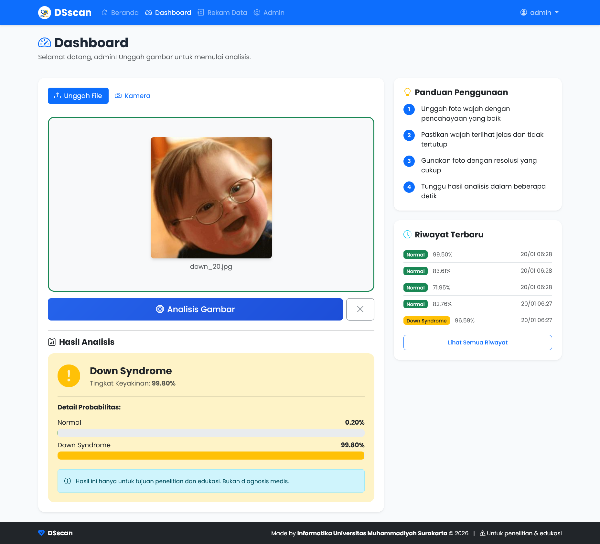

# BrightStart

<p align="center">
  
  
  
  
  
</p>

**BrightStart** adalah aplikasi web berbasis Computer Vision untuk mendeteksi indikator **Sindrom Down** dari citra wajah menggunakan model Deep Learning.

> ⚠️ **PENTING:** Aplikasi ini dibuat untuk **tujuan penelitian dan edukasi**. Hasil analisis **BUKAN merupakan diagnosis medis**. Untuk diagnosis yang akurat, selalu konsultasikan dengan dokter atau tenaga medis profesional.

---

## 📸 Screenshot

### Dashboard


---

## 📋 Daftar Isi

- [Fitur](#-fitur)
- [Teknologi](#-teknologi)
- [Persyaratan Sistem](#-persyaratan-sistem)
- [Instalasi](#-instalasi)
  - [Instalasi Lokal](#instalasi-lokal)
  - [Instalasi Docker](#instalasi-docker-cpu)
- [Konfigurasi](#-konfigurasi)
- [Penggunaan](#-penggunaan)
- [Struktur Proyek](#-struktur-proyek)
- [API Endpoints](#-api-endpoints)
- [Kontribusi](#-kontribusi)
- [Lisensi](#-lisensi)

---

## ✨ Fitur

- 🔍 **Deteksi Sindrom Down** - Analisis citra wajah menggunakan model InceptionResNetV2
- 📷 **Upload & Kamera** - Unggah gambar atau ambil foto langsung dari kamera
- 📊 **Laporan Detail** - Probabilitas dan tingkat keyakinan hasil analisis
- 👥 **Manajemen Pengguna** - Sistem login dengan hashing password
- 🛡️ **Admin Panel** - Kelola pengguna dan lihat statistik aplikasi
- 📁 **Rekam Data** - Arsip semua hasil analisis untuk penelitian
- 🐳 **Docker Ready** - Deployment mudah dengan CPU atau GPU
- 📱 **Responsif** - Tampilan optimal di desktop dan mobile

---

## 🛠️ Teknologi

| Komponen | Teknologi |
|----------|-----------|
| Backend | Flask 3.0+ |
| Database | SQLite3 |
| Admin Panel | Flask-Admin |
| Frontend | Bootstrap 5.3 |
| ML Framework | TensorFlow / Keras |
| Model | InceptionResNetV2 |
| Deployment | Docker |

---

## 💻 Persyaratan Sistem

### Minimum
- Python 3.11+
- RAM 4GB
- Storage 2GB

### Rekomendasi (untuk GPU)
- NVIDIA GPU dengan CUDA support
- NVIDIA Driver 525+
- CUDA Toolkit 12.0+
- cuDNN 8.6+

---

## 🚀 Instalasi

### Instalasi Lokal

1. **Clone repository**
   ```bash
   git clone https://github.com/username/brightstart.git
   cd brightstart
   ```

2. **Buat virtual environment**
   ```bash
   python -m venv venv
   
   # Windows
   venv\Scripts\activate
   
   # Linux/Mac
   source venv/bin/activate
   ```

3. **Install dependencies**
   ```bash
   pip install -r requirements.txt
   ```

4. **Konfigurasi environment**
   ```bash
   cp .env.example .env
   # Edit .env sesuai kebutuhan
   ```

5. **Jalankan aplikasi**
   ```bash
   python run.py
   ```

6. **Akses aplikasi**
   - Buka browser: `http://localhost:5000`
   - Login default: `admin` / `informatika`

### Instalasi Docker (CPU)

1. **Build dan jalankan**
   ```bash
   docker-compose up -d --build
   ```

2. **Akses aplikasi**
   - Buka browser: `http://localhost:5000`

### Instalasi Docker (GPU)

1. **Pastikan NVIDIA Container Toolkit terinstall**
   ```bash
   # Ubuntu
   distribution=$(. /etc/os-release;echo $ID$VERSION_ID)
   curl -s -L https://nvidia.github.io/nvidia-docker/gpgkey | sudo apt-key add -
   curl -s -L https://nvidia.github.io/nvidia-docker/$distribution/nvidia-docker.list | sudo tee /etc/apt/sources.list.d/nvidia-docker.list
   sudo apt-get update && sudo apt-get install -y nvidia-container-toolkit
   sudo systemctl restart docker
   ```

2. **Build dan jalankan**
   ```bash
   docker-compose -f docker-compose.gpu.yml up -d --build
   ```

---

## ⚙️ Konfigurasi

Edit file `.env` untuk mengkonfigurasi aplikasi:

```env
# Flask Configuration
FLASK_ENV=development
FLASK_DEBUG=1
SECRET_KEY=your-super-secret-key

# Default Admin Account
ADMIN_USERNAME=admin
ADMIN_PASSWORD=informatika

# Model Configuration
MODEL_DOWNLOAD_URL=https://github.com/your-repo/releases/download/v1.0/InceptionResNetV2.keras

# CORS Configuration
CORS_ORIGINS=*

# Upload Configuration
MAX_CONTENT_LENGTH=10485760

# Logging
LOG_LEVEL=DEBUG
```

---

## 📖 Penggunaan

### 1. Login
- Akses halaman login di `/auth/login`
- Gunakan kredensial yang telah dikonfigurasi

### 2. Dashboard
- Unggah gambar wajah atau gunakan kamera
- Klik "Analisis Gambar"
- Lihat hasil probabilitas

### 3. Admin Panel
- Akses `/admin` untuk panel admin
- Kelola pengguna dan lihat statistik
- Ubah password pengguna

### 4. Rekam Data (Admin)
- Akses `/records` untuk melihat semua hasil analisis
- Filter berdasarkan waktu, pengguna, atau hasil
- Download gambar untuk penelitian

---

## 📁 Struktur Proyek

```
brightstart/
├── app/
│   ├── __init__.py          # Application factory
│   ├── config.py            # Configuration classes
│   ├── extensions.py        # Flask extensions
│   ├── admin/               # Flask-Admin setup
│   │   └── views.py
│   ├── models/              # Database models
│   │   ├── user.py
│   │   └── prediction.py
│   ├── services/            # Business logic
│   │   ├── inference.py
│   │   └── image_processor.py
│   ├── views/               # Route blueprints
│   │   ├── main.py
│   │   ├── auth.py
│   │   ├── dashboard.py
│   │   └── records.py
│   ├── templates/           # Jinja2 templates
│   ├── static/              # CSS, JS, images
│   └── utils/               # Utility functions
├── models/                  # ML models
├── uploads/                 # Uploaded images
├── logs/                    # Application logs
├── instance/                # SQLite database
├── .env.example
├── .gitignore
├── requirements.txt
├── Dockerfile
├── Dockerfile.gpu
├── docker-compose.yml
├── docker-compose.gpu.yml
├── run.py
└── README.md
```

---

## 🔗 API Endpoints

| Method | Endpoint | Deskripsi |
|--------|----------|-----------|
| GET | `/` | Homepage |
| GET | `/auth/login` | Halaman login |
| POST | `/auth/login` | Proses login |
| GET | `/auth/logout` | Logout |
| GET | `/dashboard` | Dashboard utama |
| POST | `/dashboard/predict` | Analisis gambar |
| GET | `/dashboard/history` | Riwayat analisis |
| GET | `/records` | Rekam data (admin) |
| GET | `/admin` | Admin panel |

---

## 🤝 Kontribusi

Kontribusi sangat diterima! Silakan buat Pull Request atau Issue.

1. Fork repository
2. Buat branch fitur (`git checkout -b feature/AmazingFeature`)
3. Commit perubahan (`git commit -m 'Add some AmazingFeature'`)
4. Push ke branch (`git push origin feature/AmazingFeature`)
5. Buat Pull Request

---

## 📄 Lisensi

Proyek ini dilisensikan di bawah MIT License - lihat file [LICENSE](LICENSE) untuk detail.

---

## 👥 Tim Pengembang

**Informatika UMS – 2026**

Universitas Muhammadiyah Surakarta

---

<p align="center">
  Made with ❤️ by Informatika UMS
</p>
